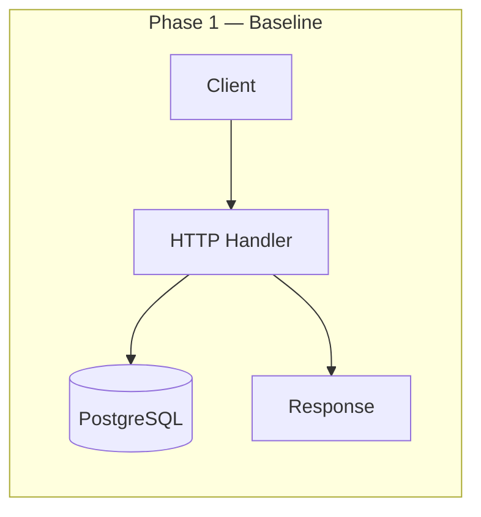
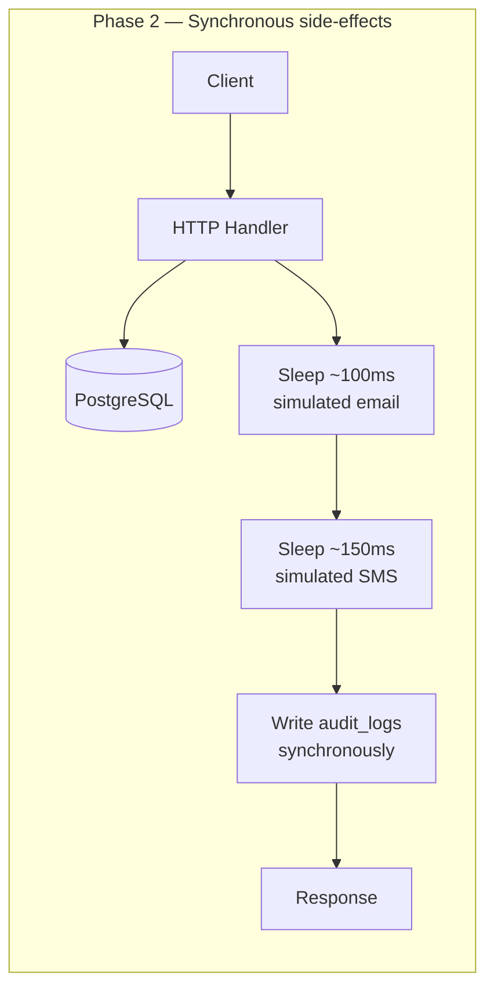
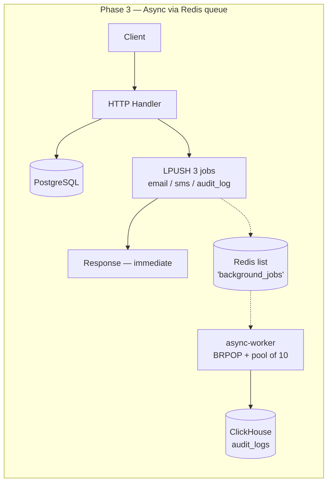
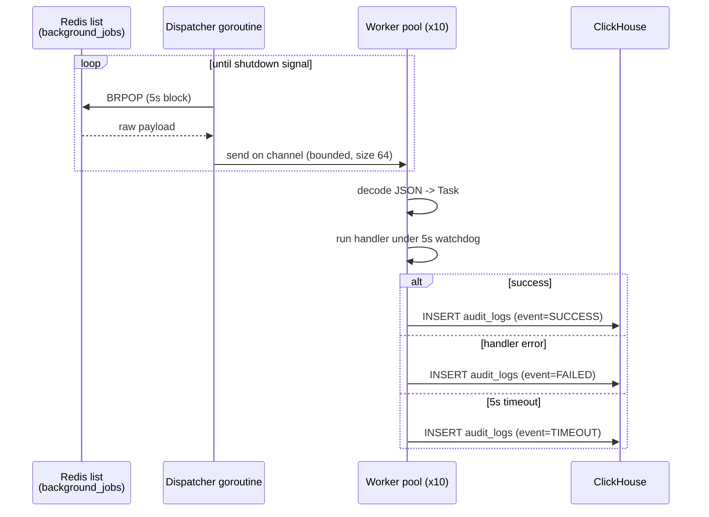

# Business Engine — From Naive Monolith to Async Job Queue

A hotel/room booking backend, deliberately built **three times over** — same
API surface, same PostgreSQL schema, same concurrency-safe booking logic —
each version representing a real architectural stage a backend goes through
as it scales. Every claim below is backed by a load test against the actual
running code, not a diagram someone drew on a whiteboard.

> **TL;DR:** moving side-effects (email, SMS, audit logging) off the request
> path and onto a Redis-backed async worker recovered **~9x the throughput**
> and cut **p99 latency by ~66%** — but getting there also uncovered a real
> production bug, not just a performance problem. That story is below.

---

## Table of contents

- [The idea](#the-idea)
- [Architecture: all three phases](#architecture-all-three-phases)
- [Phase 1 — Baseline](#phase-1--baseline)
- [Phase 2 — Synchronous side-effects (the naive "fix")](#phase-2--synchronous-side-effects-the-naive-fix)
- [Phase 3 — Async via Redis + worker service](#phase-3--async-via-redis--worker-service)
- [The load tester](#the-load-tester)
- [The results](#the-results)
- [The bug the benchmark found](#the-bug-the-benchmark-found)
- [Repo layout](#repo-layout)
- [Running it yourself](#running-it-yourself)
- [Tech stack](#tech-stack)
- [What this project is meant to show](#what-this-project-is-meant-to-show)

---

## The idea

Every backend eventually has to answer the same question: **a request comes
in, the core business logic succeeds (a user is created, a booking is
made) — now what?** Real systems don't just write a row and respond. They
send a confirmation email. They fire an SMS. They write an audit log entry
so there's a record of what happened and why.

The naive move is to do all of that *inline*, before responding to the
client. It works. It's also a landmine: every one of those steps is an
external call (SMTP, an SMS gateway, a database write) with its own
latency, its own failure modes, and its own way of dragging your whole
request/response cycle down with it.

This project builds the **same booking engine three times** to make that
landmine visible, measurable, and then defused:

| Phase | What it does | What it proves |
|---|---|---|
| **1 — Baseline** | Pure DB I/O, no side effects at all | The ceiling — what the system *could* do with zero extra work |
| **2 — Synchronous side-effects** | Email + SMS + audit log, all inline, blocking the response | What naive "just add the side effects" actually costs you |
| **3 — Async via Redis queue** | Side effects become typed jobs on a queue, processed by a separate worker | The fix — and how much of the ceiling you actually get back |

All three phases share the same PostgreSQL schema (`schema.sql`) and the
same booking-conflict logic (`tsrange` + a `GIST` exclusion constraint —
more on that below). The only thing that changes phase to phase is **what
happens after the database write succeeds.**

---

## Architecture: all three phases







The critical difference between phase 2 and phase 3 isn't "add a queue" in
the abstract — it's that in phase 2, **the client is made to wait** for
three unrelated systems (SMTP, SMS gateway, audit DB) to all succeed before
it gets an answer to "did my booking work?" In phase 3, the client gets its
answer the moment the thing it actually asked about (the booking) is
durable — everything else happens after, out of band, with its own
independent retry/failure handling.

---

## Phase 1 — Baseline

`phase1/` — the control group. Every handler does exactly one thing: the
PostgreSQL write (or read), then responds. No email, no SMS, no audit log,
no queue.

```go
query := `INSERT INTO users (email, name) VALUES ($1, $2) RETURNING id, email, name`
err := db.Pool.QueryRow(r.Context(), query, u.Email, u.Name).Scan(&u.ID, &u.Email, &u.Name)
// ...
w.WriteHeader(http.StatusCreated)
json.NewEncoder(w).Encode(u)
```

This exists to answer one question: **what's the ceiling?** Every other
phase gets measured against this number.

The one piece of real engineering here worth calling out: booking conflicts
are prevented at the database level, not in application code. `bookings`
uses a `TSRANGE` column plus a `GIST` exclusion constraint:

```sql
EXCLUDE USING GIST (
    room_id WITH =,
    during WITH &&
) WHERE (status != 'cancelled')
```

This means two overlapping bookings for the same room are *mathematically
impossible* to commit simultaneously — Postgres itself rejects the second
insert, under concurrent load, with no need for row locks, `SELECT ... FOR
UPDATE`, or application-level mutexes. A naive "check then insert" approach
has a race condition between the check and the insert; this doesn't.

---

## Phase 2 — Synchronous side-effects (the naive "fix")

`phase2/` — every mutating endpoint (`createUser`, `updateUser`,
`createBooking`, etc.) now also does this, all inline, before it responds:

```go
// Simulated welcome email.
time.Sleep(simulatedEmailDelay)   // 100ms
// Simulated welcome SMS.
time.Sleep(simulatedSMSDelay)     // 150ms

if err := writeAuditLog(r.Context(), "user", u.ID, "user_registered", details); err != nil {
    http.Error(w, fmt.Sprintf("user created but audit log failed: %v", err), http.StatusInternalServerError)
    return
}
```

This is the deliberately naive version — the one every backend accidentally
ships first, because it's the obvious way to write it and it works fine in
dev with one user hitting it. The `time.Sleep` calls stand in for a real
SMTP handshake and a real SMS gateway round-trip (Twilio, etc.) — the exact
latency numbers aren't the point, the fact that **the client's response is
now hostage to three external systems it doesn't care about** is the point.

---

## Phase 3 — Async via Redis + worker service

`phase3/` (API side) + `async-worker/` (consumer side).

The handler's job shrinks back down to just the transactional DB work. The
three side effects become typed messages pushed onto a Redis list:

```go
type TaskPayload struct {
    Type     string `json:"type"`      // "email" | "sms" | "audit_log"
    Entity   string `json:"entity"`
    EntityID int    `json:"entity_id"`
    Details  string `json:"details"`
}

func (e *handlerEnv) enqueueEventTasks(ctx context.Context, entity string, entityID int, details string) error {
    tasks := []TaskPayload{
        {Type: "email", Entity: entity, EntityID: entityID, Details: details},
        {Type: "sms", Entity: entity, EntityID: entityID, Details: details},
        {Type: "audit_log", Entity: entity, EntityID: entityID, Details: details},
    }
    for _, task := range tasks {
        if err := e.enqueueTask(ctx, task); err != nil {
            return err
        }
    }
    return nil
}
```

Notice what happens if the enqueue itself fails (Redis is down): the
handler **logs a warning and still returns 201.** The booking or user row
is already committed — that's the thing the client actually asked for. A
failed enqueue is an infrastructure problem for an alerting layer to catch,
not a reason to lie to the client about whether their request succeeded.

### The worker service (`async-worker/`)

A separate, independently deployable Go service consumes the queue. It's
not a `for { sleep(); poll() }` toy — it's built the way you'd actually want
a background processor to behave in production:



Design details that separate this from a toy queue consumer:

- **Bounded concurrency.** A fixed pool of 10 goroutines consumes from an
  internal channel — no goroutine-per-task explosion under a burst.
- **Per-task watchdog.** Every task execution gets a hard 5-second
  `context.WithTimeout`. A hung handler gets marked `TIMEOUT` and audited;
  Go can't force-kill a goroutine, but the dispatcher doesn't wait for it.
- **Independent audit context.** The outcome (`SUCCESS`/`FAILED`/`TIMEOUT`)
  is logged to ClickHouse using a *fresh* context, not the task's — because
  by the time you're logging a timeout, the task's own context is already
  expired.
- **Graceful shutdown.** `SIGINT`/`SIGTERM` stops the dispatcher from
  popping new work, closes the channel, and waits for in-flight tasks to
  drain (bounded by their own 5s watchdog) before exiting.
- **Fail-fast construction.** Both Redis and ClickHouse connections are
  verified with a ping handshake at startup — a misconfigured broker or
  sink is caught immediately, not the first time a task tries to use it.

---

## The load tester

`tester/tester.cpp` — a custom multi-threaded HTTP load generator, written
from scratch in C++ rather than reached for off the shelf (`wrk`, `ab`,
`hey`, etc.), specifically so every number in this README is backed by code
I can point at and explain line by line.

Design choices, and why they were made deliberately rather than by default:

- **A fresh TCP connection per request, with `Connection: close`.** This
  costs a full TCP handshake on every single request — more expensive than
  connection reuse — but it's a realistic thing to measure for a backend
  serving many short-lived clients, and it sidesteps having to write a full
  HTTP response parser that distinguishes chunked encoding from
  `Content-Length` framing.
- **Lock-free metric collection.** Each worker thread appends to its own
  `std::vector<RequestRecord>`; results are only merged after every thread
  has joined. No mutex contention during the run means lock contention
  never skews the latency numbers you're trying to measure.
- **Warmup exclusion.** The first `warmup_sec` seconds (default 5) are
  discarded from every metric — per-second windows and the global summary
  — so connection ramp-up and JIT/cache-warming effects don't pollute the
  steady-state numbers.
- **Linear-interpolation percentiles**, computed per-second and globally,
  matching the standard percentile definition used by most load-testing
  tools so the numbers are comparable to anything else you'd benchmark
  against.

```
Build:  g++ -O3 -std=c++17 -pthread tester.cpp -o load_test -lpthread
Run:    ./load_test [num_threads] [duration_sec] [warmup_sec]
        ./load_test              # 50 threads, 60s duration, 5s warmup
        ./load_test 100 60 5     # explicit
```

Output: a live per-second table to stdout, and a `loadtest_results.csv`
with columns `second,requests,rps,avg_latency_ms,p95_latency_ms,
p99_latency_ms,success_count,error_count` — exactly the format the plots in
this README are generated from.

---

## The results

Each phase was hit with the same load profile (50 threads, 60s, 5s warmup
discarded) against `POST /users`. Full per-second data lives in
`data_sets/phase{1,2,3}.csv`; the script that turns it into every chart
below is `plots/generate_story_plots.py`.

### The headline


### Throughput and latency, side by side


| Phase | Avg RPS | Avg p99 latency | % of baseline throughput |
|---|---|---|---|
| 1 — Baseline | 3,165 | 32ms | 100% |
| 2 — Synchronous side-effects | 193 | 266ms | **6%** |
| 3 — Async via Redis queue | 1,699 | 92ms | **54%** |


Moving the side-effects off the request path didn't just make things
faster — it recovered **9x the throughput** phase 2 had crushed down to a
sliver of baseline, while still doing genuinely useful work (three
side-effects fanned out per request) that phase 1 never had to do at all.

### Throughput over the full run


Worth calling out honestly: phase 1 (the "clean" baseline) isn't perfectly
flat — there's a dip around seconds 19-23 where throughput drops from
~3,400 rps to ~1,500 rps and recovers. That's a real artifact of the run
(likely GC pause or connection-pool churn), not a fabricated clean line.
Leaving it in is more honest than smoothing it out.

### Latency over the full run


Three clearly separated bands: phase 2 pinned near-flat around 260-280ms
(matching the 100ms + 150ms simulated email/SMS delay almost exactly —
which is itself a useful sanity check that the benchmark is measuring what
it claims to), phase 3 comfortably in the middle, phase 1 lowest with some
expected jitter.

### Distribution views


The violin plot in particular makes phase 2's story visible in a way the
bar charts can't: it's not just low throughput, it's a *needle-thin*
distribution — every single second of the run performed almost identically
badly. That's not "sometimes slow under load," that's "structurally
incapable of doing more," which is exactly what you'd expect from a fully
serialized, blocking request path.

### Success rate — the part that isn't just about speed


This is the chart that matters most, and it's the one that led to the
next section.

---

## The bug the benchmark found

Phase 2's success rate isn't "lower than the others." It's **exactly zero,
for the entire run.** Every single request returned a non-2xx response.

The instinct is to blame the load tester (maybe its timeout is too tight)
or blame "load" in general (maybe the DB connection pool is exhausted).
Neither is right here, and the benchmark data itself rules both out: the
tester only marks a request as a connection-level failure when it gets *no*
HTTP response at all — and phase 2's requests all came back with real
latency numbers, consistent with the simulated 250ms of sleeps, on every
single one. That's not a timeout or a dropped connection. That's the server
answering every request with a real, deliberate error status.

Looking at `schema.sql` confirms it: the schema defines `users`, `rooms`,
and `bookings` — **there is no `audit_logs` table.** Phase 2's handler does:

```go
func writeAuditLog(ctx context.Context, entityType string, entityID int, event, details string) error {
    query := `INSERT INTO audit_logs (...) VALUES (...)`
    _, err := db.Pool.Exec(ctx, query, ...)
    return err
}
```

Every call to this fails, because the table it's inserting into doesn't
exist. And the handler treats that as fatal:

```go
if err := writeAuditLog(r.Context(), "user", u.ID, "user_registered", details); err != nil {
    http.Error(w, fmt.Sprintf("user created but audit log failed: %v", err), http.StatusInternalServerError)
    return
}
```

The user row is already committed at this point — the actual thing the
client asked for succeeded — but the response is a 500 anyway, because the
audit write is (wrongly, in this design) treated as part of the critical
path.

**This is a more interesting finding than "synchronous side-effects are
slow."** It's a demonstration of a second, independent failure mode of the
naive architecture: when you chain unrelated concerns (business logic,
notifications, auditing) into one synchronous critical path, a bug in the
*least* important one (an audit log — nice to have, not required for the
booking to be valid) takes down the *most* important one (whether the
client's request succeeds at all). Phase 3 doesn't have this problem for a
structural reason, not a lucky one: its audit writes happen in a completely
separate process, against a completely separate database (ClickHouse), on
a completely separate failure path that can never touch the HTTP response.

---

## Repo layout

```
.
├── phase1/            # Baseline — pure DB I/O, no side effects
│   ├── main.go
│   ├── api/handlers.go
│   ├── db/postgres.go
│   ├── go.mod / go.sum
│
├── phase2/            # Synchronous side-effects (the naive version)
│   ├── main.go
│   ├── api/handler.go
│   ├── db/postgres.go
│   ├── go.mod / go.sum
│
├── phase3/            # Async producer — enqueues jobs to Redis
│   ├── main.go
│   ├── api/handler.go
│   ├── db/postgres.go
│   ├── broker/client.go
│   ├── go.mod / go.sum
│
├── async-worker/      # Async consumer — separate service, own module
│   ├── main.go
│   ├── connection/connect_redis.go
│   ├── connection/connect_clickhouse.go
│   ├── workers/worker.go
│   ├── go.mod / go.sum
│
├── tester/
│   └── tester.cpp     # Custom C++ load generator
│
├── data_sets/
│   ├── phase1.csv
│   ├── phase2.csv
│   └── phase3.csv
│
├── plots/
│   ├── generate_story_plots.py
│   └── *.png           # All charts in this README
│
├── schema.sql          # Shared PostgreSQL schema (all 3 phases)
└── README.md
```

Each of `phase1/`, `phase2/`, `phase3/`, and `async-worker/` is its own
self-contained Go module — `cd` into any single one and `go run .` works
without needing the rest of the repo.

---

## Running it yourself

1. **Set up Postgres** with `schema.sql`:
   ```bash
   psql "$DATABASE_URL" -f schema.sql
   ```
2. **Run any phase's API server** (defaults to `localhost:8080`):
   ```bash
   cd phase1 && go run .        # or phase2, phase3
   ```
   Phase 3 additionally needs Redis reachable at `localhost:6379`
   (`REDIS_ADDR` env var to override).
3. **For phase 3 only**, also run the worker service in a second terminal:
   ```bash
   cd async-worker && go run .
   ```
   Needs `CLICKHOUSE_DSN` set (defaults to
   `clickhouse://default:@localhost:9000/default`).
4. **Build and run the load tester**:
   ```bash
   cd tester
   g++ -O3 -std=c++17 -pthread tester.cpp -o load_test -lpthread
   ./load_test 50 60 5
   ```
5. **Regenerate the plots** from any CSV output:
   ```bash
   cd plots && python3 generate_story_plots.py
   ```

---

## Tech stack

- **Go** — `net/http` (stdlib router, no framework), `pgx/v5` for
  PostgreSQL, `go-redis/v9` for the queue, `clickhouse-go/v2` for the audit
  sink
- **PostgreSQL** — `TSRANGE` + `GIST` exclusion constraints for
  race-condition-free booking conflicts
- **Redis** — simple list (`LPUSH`/`BRPOP`) as a lightweight job queue
- **ClickHouse** — append-only audit log sink, chosen for the async
  worker's write path specifically because it's a separate system from the
  main transactional database
- **C++17** — the custom load-testing tool (raw sockets, `pthread`, no
  external HTTP or benchmarking libraries)
- **Python** (matplotlib, seaborn, pandas) — turning raw CSV benchmark
  output into the charts in this README

---

## What this project is meant to show

Not "I know how to add a queue." Anyone can read that a queue decouples
producers from consumers. This project is meant to show:

- I can build the *naive* version correctly first, and I understand why
  it's naive — not just assert that it is.
- I can design and build my own measurement tooling instead of trusting a
  black-box benchmark tool, and explain every methodological choice in it.
- I can read a benchmark result critically enough to catch that "100%
  error rate" isn't the same signal as "high latency" — and trace it back
  to a real, specific bug in the schema rather than hand-waving it away as
  noise.
- I understand what actually changes, structurally, when you move work off
  a request path — not just that throughput numbers go up, but *why* the
  failure modes change too.
