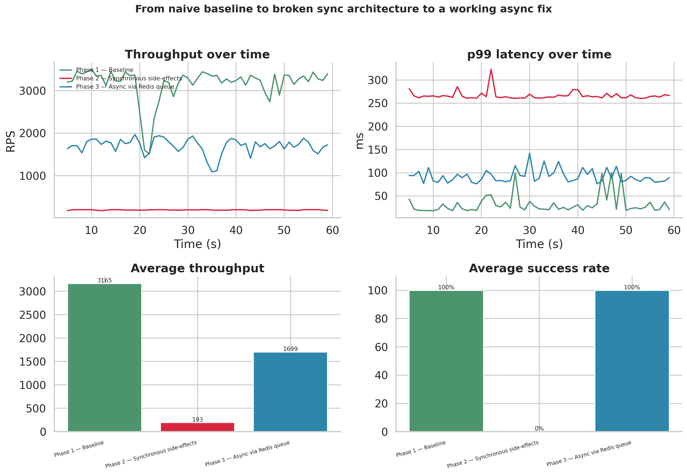
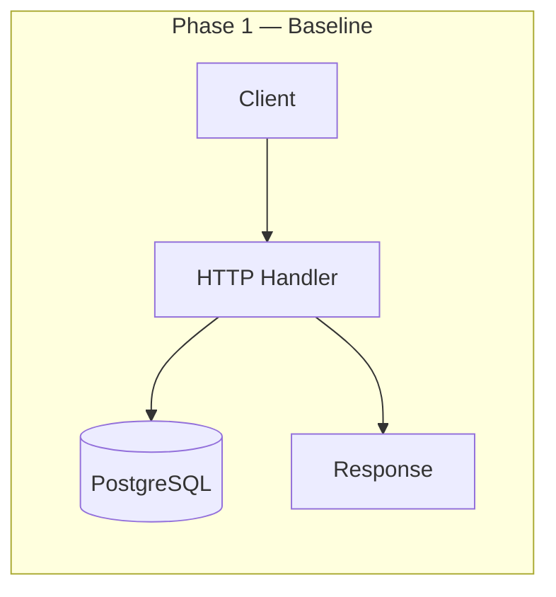
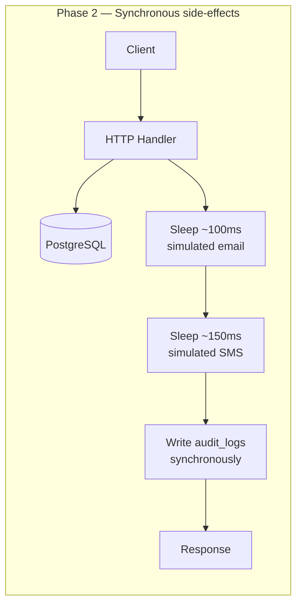
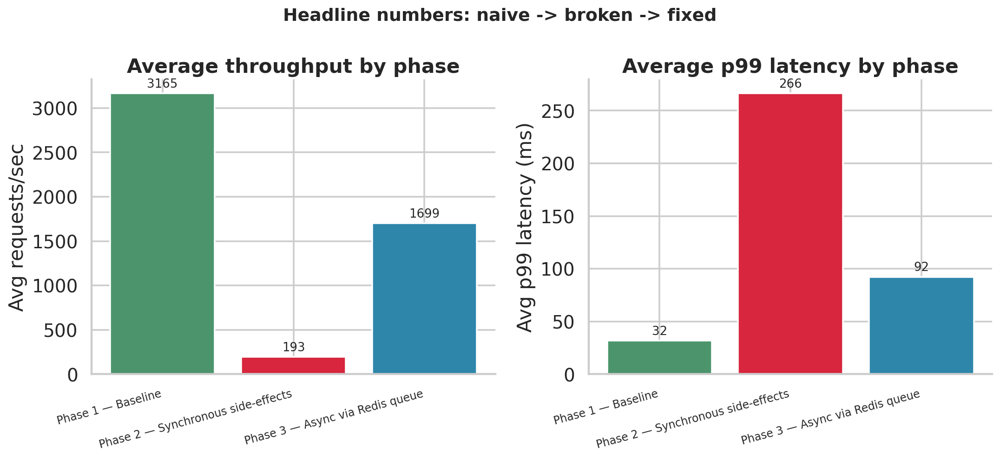
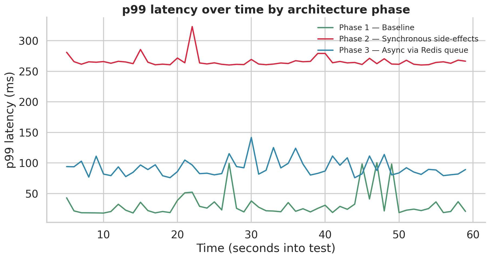
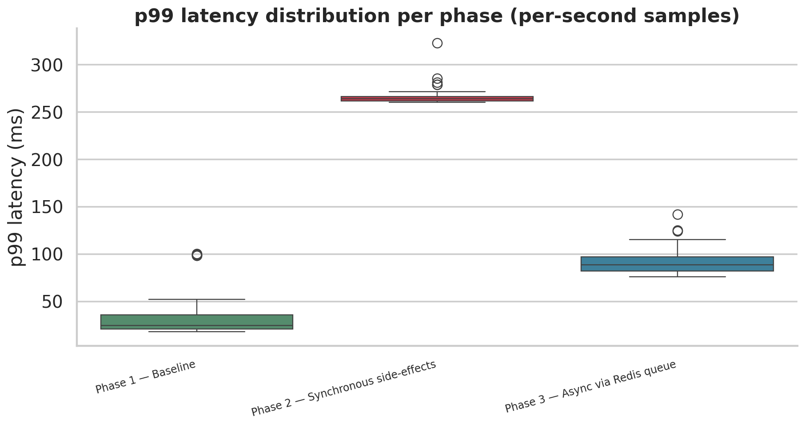
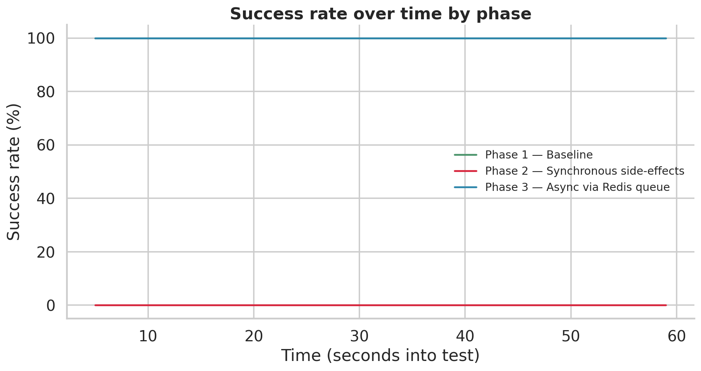

# Business Engine

A booking API rebuilt three times to measure the real cost of naive synchronous side-effects — and prove the fix with benchmarks backed by custom load-testing code.




---

## The Problem

Every backend eventually hits the same fork: a request succeeds, the core write is durable — now what?

Real systems don't just write a row and respond. They send confirmation emails, fire SMS alerts, write audit logs. The intuitive approach is to do all three **inline, before responding**. It works until it doesn't.

This repository builds the same booking engine **three times** to make that failure mode measurable and then fix it:

| Metric | Phase 1: Baseline | Phase 2: Sync Side-Effects | Phase 3: Async Queue |
|--------|------------------:|------------------------------:|-------------------:|
| **Throughput (req/s)** | 3,165 | 193 | 1,699 |
| **p99 Latency (ms)** | 32 | 266 | 92 |
| **% of Baseline** | 100% | 6% | **54%** |
| **Success Rate** | 100% | **0%** | 100% |

The success rate isn't a typo. Phase 2 fails entirely — and the benchmark reveals why.

---

## Architecture Overview

### Phase 1: Baseline

Pure database I/O. The control group that establishes the ceiling.



### Phase 2: Synchronous Side-Effects

The naive approach. Email, SMS, and audit logging happen inline before responding.



### Phase 3: Async via Redis Queue

The fix. Side-effects decouple from the request path; a separate worker service processes them.


The critical difference: in Phase 2, the client waits for systems it never asked about (SMTP, SMS gateway, audit database). In Phase 3, the response arrives the moment the booking is durable. Everything else happens independently after.

---

## Implementation Details

### Phase 1: Baseline Design

Pure transactional write with optimistic concurrency control at the database level:

```go
query := `INSERT INTO users (email, name) VALUES ($1, $2) RETURNING id, email, name`
err := db.Pool.QueryRow(r.Context(), query, u.Email, u.Name).Scan(&u.ID, &u.Email, &u.Name)
w.WriteHeader(http.StatusCreated)
json.NewEncoder(w).Encode(u)
```

Booking conflicts are prevented by the database, not application logic:

```sql
EXCLUDE USING GIST (
    room_id WITH =,
    during WITH &&
) WHERE (status != 'cancelled')
```

A PostgreSQL `TSRANGE` + `GIST` exclusion constraint makes simultaneous overlapping bookings for the same room mathematically impossible. No row locks, no `SELECT FOR UPDATE`, no application-level mutex — the database rejects the second insert outright.

### Phase 2: Naive Synchronous Side-Effects

Every mutating endpoint now does this inline, before responding:

```go
time.Sleep(simulatedEmailDelay)   // 100ms
time.Sleep(simulatedSMSDelay)     // 150ms
if err := writeAuditLog(ctx, "user", u.ID, "user_registered", details); err != nil {
    http.Error(w, "user created but audit log failed", http.StatusInternalServerError)
    return
}
```

The sleeps simulate real SMTP/SMS gateway latency. The result: **the client's response is now hostage to three systems it doesn't care about.**

### Phase 3: Async via Redis + Worker Service

The handler shrinks back to just the transactional write. Side-effects become typed jobs on a Redis queue:

```go
type TaskPayload struct {
    Type     string `json:"type"`      // "email" | "sms" | "audit_log"
    Entity   string `json:"entity"`
    EntityID int    `json:"entity_id"`
    Details  string `json:"details"`
}
```

If Redis is unavailable, the handler logs a warning but **still returns 201** — the booking is already committed, which is what the client asked for. An enqueue failure is infrastructure instrumentation, not a reason to lie about success.

#### Worker Architecture

- **Bounded concurrency**: A fixed 10-goroutine pool; no explosion under burst load
- **Per-task watchdog**: 5-second timeout per task; hung handlers are marked `TIMEOUT`
- **Independent audit context**: Outcome logging uses a fresh context, since timed-out tasks' original context is already expired
- **Graceful shutdown**: Drains in-flight work on `SIGINT`/`SIGTERM`
- **Fail-fast initialization**: Redis and ClickHouse connectivity verified at startup

---

## Benchmarking Methodology

### Custom Load Tester

`tester/tester.cpp` — a multi-threaded HTTP load generator written from scratch in C++17, ensuring every number in this repository is backed by code you can read and verify.

**Design choices:**
- **Fresh TCP connection per request** (`Connection: close`): Realistic for many short-lived clients; also eliminates the need for chunked/`Content-Length` HTTP parsing
- **Lock-free metrics**: Each thread appends to its own vector; results merge only after all threads join. Zero contention on the measurement itself
- **Warmup exclusion**: First 5 seconds discarded from all metrics to exclude connection ramp-up noise
- **Linear-interpolation percentiles**: Computed per-second and globally — standard methodology used by most load-testing tools

```bash
g++ -O3 -std=c++17 -pthread tester.cpp -o load_test -lpthread
./load_test 50 60 5    # 50 threads, 60s duration, 5s warmup
```

### Test Profile

All three phases hit `POST /users` under identical load: 50 threads, 60s duration, 5s warmup discarded.

Raw data: `data_sets/phase{1,2,3}.csv`  
Regenerate all charts: `plots/generate_story_plots.py`

---

## Results

### Throughput Comparison



Async clawed back **9x** the throughput Phase 2 had crushed, while actually doing real work (three fanned-out side-effects per request) that Phase 1 never had to handle.

### Latency Over Time



Three clean, separated bands. Phase 2 sits flat around 260–280ms — which matches almost exactly the 100ms + 150ms simulated delays, confirming the benchmark measures what it claims.

### Latency Distribution



Phase 2 isn't just slow — it's a needle-thin distribution. Nearly every second performed identically badly. That's not "occasionally struggles," that's "structurally incapable of doing more."

### Success Rate — The Unexpected Finding



Phase 2's success rate is **exactly zero**, for the entire run. Every request returned non-2xx.

#### Why This Happened

`schema.sql` defines `users`, `rooms`, and `bookings` — but **no `audit_logs` table**. Phase 2's handler calls:

```go
func writeAuditLog(ctx context.Context, entityType string, entityID int, event, details string) error {
    query := `INSERT INTO audit_logs (...) VALUES (...)`
    _, err := db.Pool.Exec(ctx, query, ...)
    return err
}
```

Every call fails. The handler treats this as fatal:

```go
if err := writeAuditLog(r.Context(), "user", u.ID, "user_registered", details); err != nil {
    http.Error(w, fmt.Sprintf("user created but audit log failed: %v", err), http.StatusInternalServerError)
    return
}
```

The user row is already committed — the thing the client asked for succeeded — but the response is a 500 anyway. **An audit write (a side-effect, not required for booking validity) brought down the critical path.**

This is the more important finding than "sync side-effects are slow." It shows the second failure mode: chain unrelated concerns into one path, and a bug in the least important one takes down the most important one.

Phase 3 doesn't have this problem structurally. Audit writes happen in a separate process, against a separate database, on a failure path that can never touch the HTTP response.

---

## Running It

```bash
# Set up schema
psql "$DATABASE_URL" -f schema.sql

# Run any phase (defaults to localhost:8080)
cd phase1 && go run .      # or phase2, phase3

# Phase 3 also needs Redis
# (set REDIS_ADDR to override localhost:6379)

# Run the worker service (separate terminal)
cd async-worker && go run .
# needs CLICKHOUSE_DSN (defaults to clickhouse://default:@localhost:9000/default)

# Compile and run the load tester
cd tester
g++ -O3 -std=c++17 -pthread tester.cpp -o load_test -lpthread
./load_test 50 60 5

# Regenerate all plots
cd plots && python3 generate_story_plots.py
```

---

## Repository Layout

```
.
├── phase1/                 # Baseline — pure DB I/O
├── phase2/                 # Synchronous side-effects (naive version)
├── phase3/                 # Async producer — enqueues to Redis
├── async-worker/           # Async consumer — separate service
├── tester/
│   └── tester.cpp          # Custom C++ load generator
├── data_sets/
│   └── phase{1,2,3}.csv
├── plots/
│   ├── generate_story_plots.py
│   └── *.png
├── schema.sql              # PostgreSQL schema
└── README.md
```

Each of `phase1/`, `phase2/`, `phase3/`, and `async-worker/` is a standalone Go module. `cd` and `go run .` works independently.

---

## Tech Stack

- **Go** (`net/http` stdlib, no framework)
- **PostgreSQL** (`TSRANGE` + `GIST` exclusion constraints)
- **Redis** (`LPUSH`/`BRPOP` job queue)
- **ClickHouse** (append-only audit sink, deliberately separate from transactional DB)
- **C++17** (custom load tester — raw sockets, `pthread`, no external benchmarking libraries)
- **Python** (matplotlib + seaborn + pandas for plot generation)

---

## What This Demonstrates

This is not "I know queues decouple producers from consumers." Anyone can read that. Instead:

- **I build the naive version correctly**, understand *why* it's naive — not just assert that it is
- **I design and build my own measurement tooling**, can explain every methodological choice
- **I read benchmark results critically** — a 100% error rate isn't the same signal as high latency; I traced it back to a real bug instead of dismissing it as noise
- **I understand structural failure mode changes**, not just that throughput goes up, but *why* failure modes change when work moves off the request path
