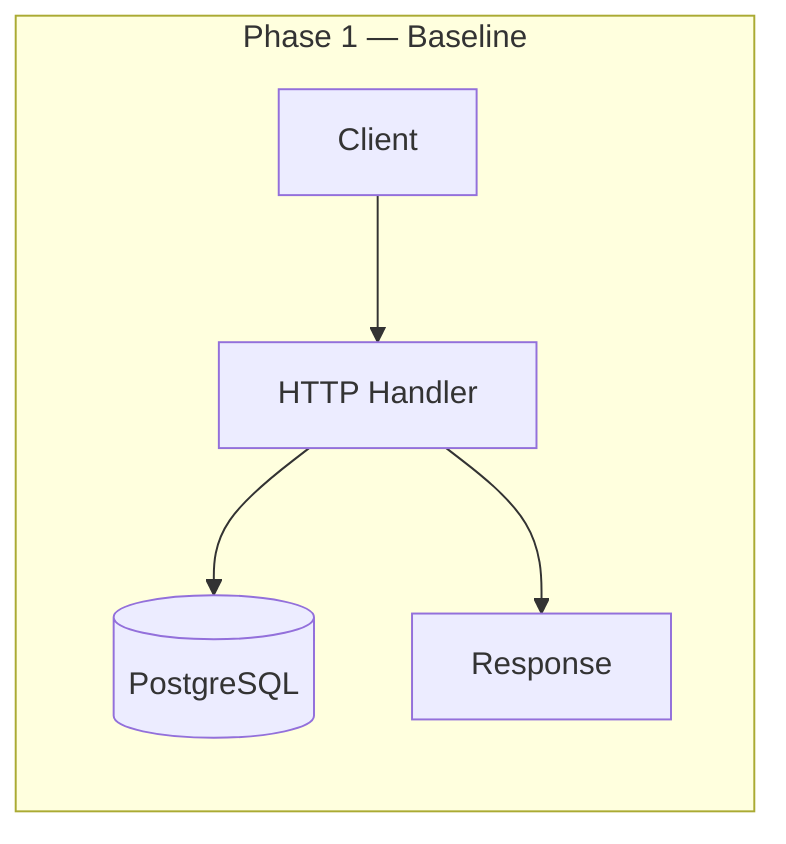
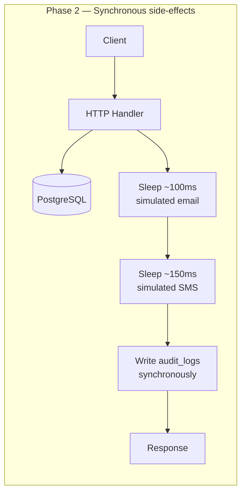
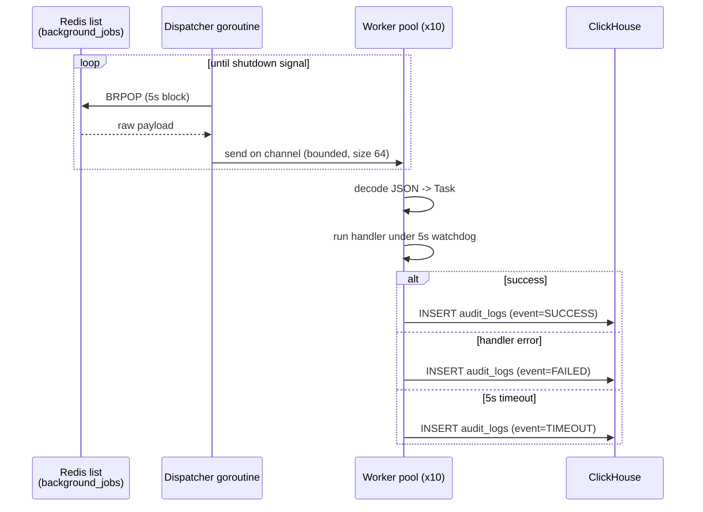
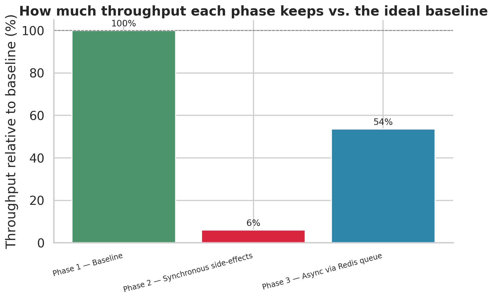
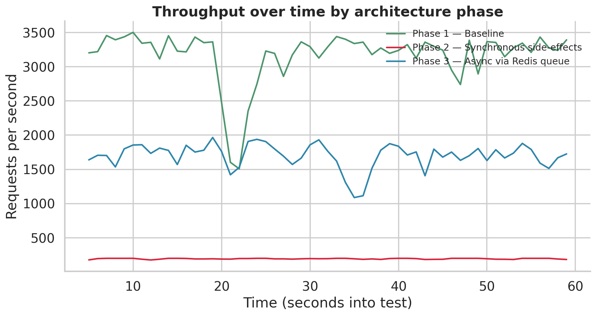
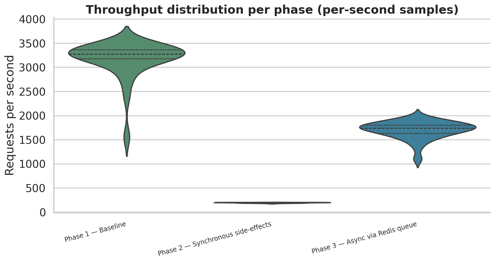
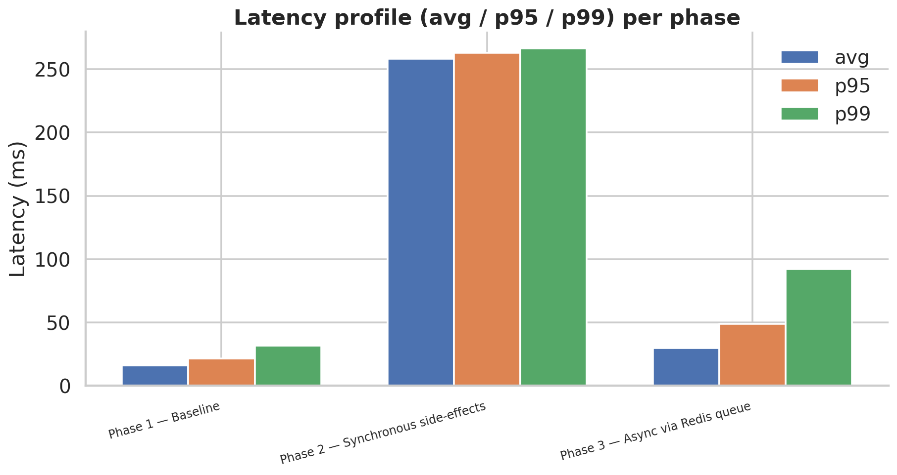

# Business Engine

### A booking API rebuilt three times to answer one question: what does it actually cost to do things the naive way — and prove the fix with real numbers.

<p>
  
  
  
  
  
</p>

---


**Every number on this page came from a real load test against real running
code** — not a diagram, not an estimate. Async job processing recovered
**9x the throughput** a naive synchronous design had crushed, and cut
**p99 latency by 66%** — and along the way, the benchmark itself caught a
real production bug that a clean-looking chart would have hidden. That
story is below, in full, including the part where the naive version broke.

---

## Why this exists

Every backend hits the same fork in the road: a request comes in, the core
write succeeds — now what? Real systems don't just write a row and
respond. They send a confirmation email. They fire an SMS. They write an
audit log entry. The naive move is to do all three **inline, before
responding** — and it works, right up until it doesn't.

This repo builds the same booking engine **three times** to make that
failure mode visible, measurable, and then fixed:

| | Phase 1 — Baseline | Phase 2 — Synchronous | Phase 3 — Async |
|---|:---:|:---:|:---:|
| **What it does** | Pure DB I/O, nothing else | Email + SMS + audit log, all inline | Same side-effects, pushed to a Redis queue |
| **Avg throughput** | 3,165 req/s | 193 req/s | 1,699 req/s |
| **Avg p99 latency** | 32ms | 266ms | 92ms |
| **% of baseline kept** | 100% | 6% | **54%** |
| **Success rate** | 100% | **0%** | 100% |

That last row isn't a typo. Keep reading.

---

## Table of contents

- [Architecture, all three phases](#architecture-all-three-phases)
- [Phase 1 — Baseline](#phase-1--baseline)
- [Phase 2 — Synchronous side-effects](#phase-2--synchronous-side-effects-the-naive-fix)
- [Phase 3 — Async via Redis + worker service](#phase-3--async-via-redis--worker-service)
- [The load tester](#the-load-tester)
- [The results, in full](#the-results-in-full)
- [The bug the benchmark found](#the-bug-the-benchmark-found)
- [Repo layout](#repo-layout)
- [Running it yourself](#running-it-yourself)
- [Tech stack](#tech-stack)
- [What this demonstrates](#what-this-demonstrates)

---

## Architecture, all three phases






The difference that matters isn't "add a queue" as an abstract idea — it's
that in phase 2, **the client is made to wait** on three systems it never
asked about (SMTP, an SMS gateway, an audit DB) before it learns whether
its own request even worked. In phase 3, the client's answer arrives the
moment the thing it asked about is durable. Everything else happens after,
independently, with its own failure handling that can never touch the
response.

---

## Phase 1 — Baseline

`phase1/` — the control group. One DB write (or read), then a response.
No email, no SMS, no audit log, no queue. This exists to answer exactly
one question: **what's the ceiling?**

```go
query := `INSERT INTO users (email, name) VALUES ($1, $2) RETURNING id, email, name`
err := db.Pool.QueryRow(r.Context(), query, u.Email, u.Name).Scan(&u.ID, &u.Email, &u.Name)
w.WriteHeader(http.StatusCreated)
json.NewEncoder(w).Encode(u)
```

The real engineering here: booking conflicts are prevented **at the
database level**, not in application code —

```sql
EXCLUDE USING GIST (
    room_id WITH =,
    during WITH &&
) WHERE (status != 'cancelled')
```

`TSRANGE` + a `GIST` exclusion constraint makes two overlapping bookings
for the same room *mathematically impossible* to commit simultaneously.
Postgres rejects the second insert outright, under concurrent load, with
no row locks, no `SELECT ... FOR UPDATE`, no application-level mutex. A
naive "check then insert" has a race condition between the check and the
write; this doesn't, by construction.

---

## Phase 2 — Synchronous side-effects (the naive "fix")

`phase2/` — every mutating endpoint now also does this, inline, before
responding:

```go
time.Sleep(simulatedEmailDelay) // 100ms
time.Sleep(simulatedSMSDelay)   // 150ms

if err := writeAuditLog(r.Context(), "user", u.ID, "user_registered", details); err != nil {
    http.Error(w, fmt.Sprintf("user created but audit log failed: %v", err), http.StatusInternalServerError)
    return
}
```

This is the version every backend accidentally ships first — it's the
obvious way to write it, and it works fine with one user hitting it in
dev. The `time.Sleep` calls stand in for a real SMTP handshake and SMS
gateway round-trip. The point isn't the exact delay — it's that **the
client's response is now hostage to three systems it doesn't care about.**

---

## Phase 3 — Async via Redis + worker service

`phase3/` (producer) + `async-worker/` (consumer, its own deployable
service). The handler's job shrinks back to just the transactional write.
Side effects become typed jobs on a Redis list:

```go
type TaskPayload struct {
    Type     string `json:"type"`      // "email" | "sms" | "audit_log"
    Entity   string `json:"entity"`
    EntityID int    `json:"entity_id"`
    Details  string `json:"details"`
}
```

If the enqueue itself fails (Redis down), the handler logs a warning and
**still returns 201** — the booking or user row is already committed,
which is the thing the client actually asked for. A failed enqueue is an
infra problem for an alerting layer, not a reason to lie about success.

### The worker service



What separates this from a toy queue consumer:

- **Bounded concurrency** — a fixed 10-goroutine pool, no explosion under a burst
- **Per-task watchdog** — a hard 5s timeout per task; a hung handler is marked `TIMEOUT`, not left to hang the pool
- **Independent audit context** — the outcome is logged with a *fresh* context, since a timed-out task's own context is already expired by the time you're logging it
- **Graceful shutdown** — `SIGINT`/`SIGTERM` drains in-flight work before exiting
- **Fail-fast construction** — Redis and ClickHouse are ping-verified at startup, not on first use

---

## The load tester

`tester/tester.cpp` — a multi-threaded HTTP load generator, **written from
scratch in C++** rather than reached for off the shelf, specifically so
every number in this README is backed by code I can point at and explain.

- **Fresh TCP connection per request, `Connection: close`.** Costs a full
  handshake every time — deliberately, because it's a realistic profile
  for many short-lived clients, and it avoids needing a full chunked/
  `Content-Length` HTTP response parser.
- **Lock-free metrics.** Each thread appends to its own vector; results
  merge only after every thread joins. Contention never skews the numbers
  you're trying to measure.
- **Warmup exclusion.** The first 5 seconds are discarded from every
  metric so connection ramp-up doesn't pollute steady-state numbers.
- **Linear-interpolation percentiles**, computed per-second and globally —
  the same method most standard load-testing tools use.

```bash
g++ -O3 -std=c++17 -pthread tester.cpp -o load_test -lpthread
./load_test 50 60 5    # 50 threads, 60s duration, 5s warmup
```

---

## The results, in full

Same load profile — 50 threads, 60s, 5s warmup discarded — hit
`POST /users` on all three phases. Raw data: `data_sets/phase{1,2,3}.csv`.
Regenerate every chart below with `plots/generate_story_plots.py`.

### Throughput and latency, head to head




Async didn't just make things faster — it clawed back **9x** the
throughput phase 2 had crushed to a sliver of baseline, while still doing
real work (three fanned-out side-effects per request) phase 1 never had to
do at all.

### Throughput, second by second



Worth being honest about: phase 1 isn't a perfectly flat line — there's a
dip around seconds 19–23 where it drops from ~3,400 to ~1,500 rps and
recovers. Likely a GC pause or connection-pool churn. Left in deliberately,
because smoothing it out would be less honest than the real run.

### Latency, second by second


Three clean, separated bands. Phase 2 sits almost flat around 260–280ms —
which lines up almost exactly with the 100ms + 150ms simulated email/SMS
delay, a useful sanity check that the benchmark is measuring what it
claims to.

### Distribution — not just averages




The violin plot tells a story the bar charts can't: phase 2 isn't just
slow, it's a **needle-thin** distribution — nearly every second performed
identically badly. That's not "occasionally struggles under load," that's
"structurally incapable of doing more," exactly what you'd expect from a
fully serialized, blocking request path.



### Success rate — the chart that changed the story


This is the one that matters most. Every other chart says "phase 2 is
slow." This one says something else entirely.

---

## The bug the benchmark found

Phase 2's success rate isn't low. It's **exactly zero, for the entire
run.** Every request came back non-2xx.

The easy explanations don't hold up. It's not the load tester timing out —
the tester only flags a connection-level failure when it gets *no* HTTP
response, and every one of phase 2's requests came back with a real
latency number, matching the simulated 250ms of sleeps almost exactly.
That's a server deliberately returning an error status, every time.

`schema.sql` confirms why: it defines `users`, `rooms`, and `bookings` —
**there is no `audit_logs` table.** Phase 2's handler does:

```go
func writeAuditLog(ctx context.Context, entityType string, entityID int, event, details string) error {
    query := `INSERT INTO audit_logs (...) VALUES (...)`
    _, err := db.Pool.Exec(ctx, query, ...)
    return err
}
```

Every call fails — the table doesn't exist — and the handler treats that
as fatal:

```go
if err := writeAuditLog(r.Context(), "user", u.ID, "user_registered", details); err != nil {
    http.Error(w, fmt.Sprintf("user created but audit log failed: %v", err), http.StatusInternalServerError)
    return
}
```

The user row is already committed at this point — the thing the client
actually asked for succeeded — but the response is a 500 anyway, because
an audit write (nice to have, not required for the booking to be valid) is
wrongly treated as part of the critical path.

**This is a better finding than "synchronous side-effects are slow."** It
shows a second, independent failure mode: chain unrelated concerns —
business logic, notifications, auditing — into one synchronous path, and a
bug in the *least* important one takes down the *most* important one.
Phase 3 doesn't have this problem for a structural reason, not a lucky
one: its audit writes happen in a separate process, against a separate
database, on a failure path that can never touch the HTTP response.

---

## Repo layout

```
.
├── phase1/            # Baseline — pure DB I/O, no side effects
├── phase2/            # Synchronous side-effects (the naive version)
├── phase3/            # Async producer — enqueues jobs to Redis
├── async-worker/      # Async consumer — separate service, own module
├── tester/
│   └── tester.cpp     # Custom C++ load generator
├── data_sets/
│   └── phase{1,2,3}.csv
├── plots/
│   ├── generate_story_plots.py
│   └── *.png           # every chart in this README
├── schema.sql          # Shared PostgreSQL schema
└── README.md
```

Each of `phase1/`, `phase2/`, `phase3/`, and `async-worker/` is its own
self-contained Go module — `cd` into any one and `go run .` works without
the rest of the repo.

---

## Running it yourself

```bash
# 1. Schema
psql "$DATABASE_URL" -f schema.sql

# 2. Run any phase's API (defaults to localhost:8080)
cd phase1 && go run .      # or phase2, phase3
# phase3 also needs Redis at localhost:6379 (REDIS_ADDR to override)

# 3. Phase 3 only — run the worker in a second terminal
cd async-worker && go run .
# needs CLICKHOUSE_DSN (defaults to clickhouse://default:@localhost:9000/default)

# 4. Load test
cd tester
g++ -O3 -std=c++17 -pthread tester.cpp -o load_test -lpthread
./load_test 50 60 5

# 5. Regenerate every chart in this README
cd plots && python3 generate_story_plots.py
```

---

## Tech stack

**Go** (`net/http` stdlib, no framework) · **PostgreSQL** (`TSRANGE` +
`GIST` exclusion constraints) · **Redis** (`LPUSH`/`BRPOP` job queue) ·
**ClickHouse** (append-only audit sink, deliberately a separate system
from the transactional DB) · **C++17** (custom load tester — raw sockets,
`pthread`, zero external benchmarking libraries) · **Python** (matplotlib
+ seaborn + pandas — every chart above, generated from raw CSVs)

---

## What this demonstrates

Not "I know a queue decouples producers from consumers." Anyone can read
that. This is meant to show:

- **I build the naive version correctly first**, and understand *why*
  it's naive — not just assert that it is.
- **I design and build my own measurement tooling** instead of trusting a
  black box, and can explain every methodological choice in it.
- **I read benchmark results critically.** A 100% error rate isn't the
  same signal as high latency — I traced it back to a real bug in the
  schema instead of hand-waving it away as noise.
- **I understand what actually changes, structurally**, when work moves
  off a request path — not just that the throughput number goes up, but
  *why* the failure modes change too.
